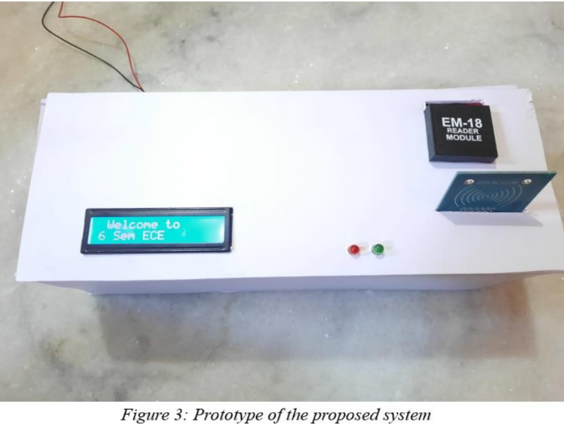
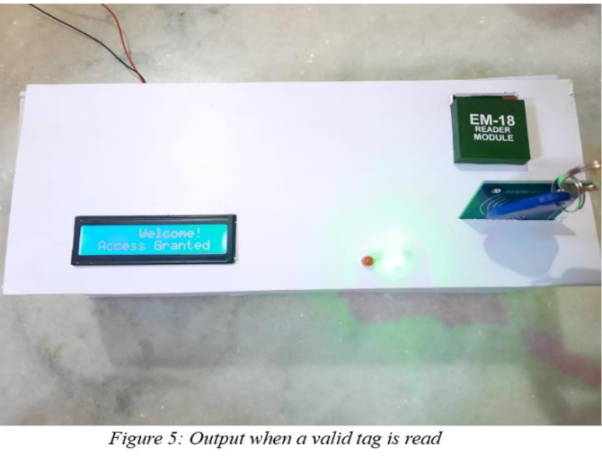
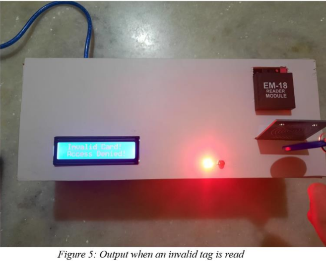
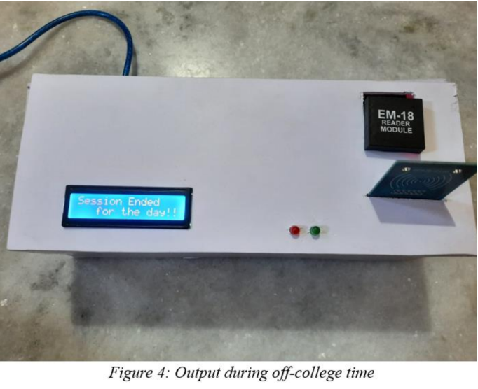

# RFID-RC522-and-EM-18-Based-Attendance-Management-System

The project aims to create an RFID-based attendance system using an Arduino board, RC522 and EM-18 RFID modules, and an LCD display. Teachers use RFID cards, while students use RFID tags to mark attendance, with real-time data tracking, LED indicators, and a buzzer for card/tag detection.

**Hardware Components:**

- Arduino UNO
- RFID RC522 module
- EM-18 reader module
- 16x2 LCD Display with I2C Module
- LEDs
- Buzzers

**Software:**

- Arduino IDE

**Methodology:**

- RFID RC522 module used for wireless communication.
- EM-18 reader module for detecting and reading RFID Cards.
- RTC module for real-time information (date and time).
- Teachers are provided RFID cards, students with RFID tags.
- Teacher's RFID card scanned at EM-18 reader, data sent to Arduino.
- Arduino verifies teacher's identity using registered IDs.
- Display teacher's name and class.
- Students scan their RFID tags at RC522 Reader for attendance.
- Valid tags display student's name, USN, login time, and blink green LED.
- Invalid tags show "invalid tag/access denied" with a red LED blink.
- Teachers scan their RFID cards again to block further student counting.
- Display student count on LCD screen.
- Delay until the next day to prevent further data recording.
- Buzzer beeps when a card/tag is read.

Output:

1. Prototype of the Proposed System
   

2. When the Read Tag is valid
   

3. When the Read Tag is InValid
   

4. During Off College Time
   
